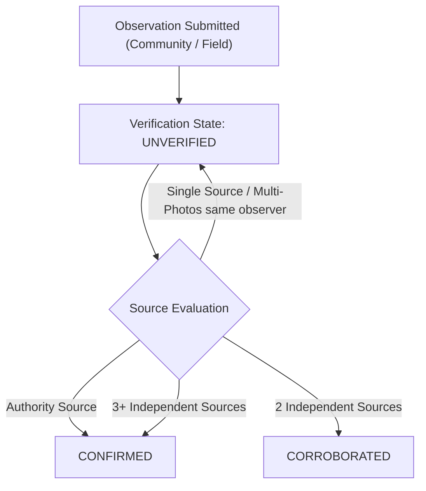

# AQUORA Phase 13A — Ground Truth & Photo Verification Foundation
**Observational Evidence, Incident Clustering, Verification & Model Comparison**

---

## 1. Architecture & Design Principles

The AQUORA Phase 13 Ground Truth engine establishes an auditable observational feedback loop:

$$\text{PREDICT (Phase 9 Digital Twin)} \longrightarrow \text{OBSERVE (Community/Field)} \longrightarrow \text{COMPARE (Slice Match)} \longrightarrow \text{VERIFY (Multi-Source Rules)} \longrightarrow \text{LEARN LATER (ML Handoff)}$$

### Core Guiding Philosophies
1. **No Single Citizen Report as Absolute Truth**: A single report, photo, or Computer Vision (CV) inference NEVER overrides the authoritative flood simulation or automatically marks an observation as confirmed.
2. **Strict Multi-Source Corroboration**: Multiple reports or photos from the *same* observer count as **one** source. Corroboration strictly requires independent observers.
3. **Qualitative Depth Classes**: Arbitrary photographs yield qualitative depth categories (`DRY`, `<10 cm`, `10–20 cm`, `20–40 cm`, `>40 cm`, `UNKNOWN`) rather than fake millimeter precision.
4. **Read-Only Model Protection**: Ground Truth collects structured evidence for future model calibration handoff. It **never** triggers automatic model retraining or overwrites physical simulation rasters.

---

## 2. Domain Data Model & Entity Specifications

- **`FloodObservation`**: Primary observation record submitted by community members, field response crews, sensors, or municipal authorities.
- **`ObservationMedia`**: Associated media attachments (JPEG, PNG, WebP, MP4) with SHA256 hashes, validated MIME types, path-traversal safety, and quality assessments.
- **`FloodIncident`**: Spatial-temporal cluster grouping compatible observations within a deterministic radius ($\le 250\text{m}$) and time window ($\le 60\text{m}$).
- **`ObservationComparison`**: Auditable record matching an observation against the nearest canonical Digital Twin slice (`T+0` to `T+180`).
- **`GroundTruthRun`**: Execution audit log tracking observation ingestion, clustering, and comparison passes.
- **`GroundTruthEvidence`**: Corroborating evidence metadata records (field reports, photo assessment, SAR satellite metadata).

---

## 3. Observation Lifecycle & Verification Rules

### Verification Taxonomy & Invariants
- **`UNVERIFIED`**: Default state for single community reports, photo uploads, or CV outputs.
- **`CORROBORATED`**: Granted iff $\ge 2$ observations AND $\ge 2$ distinct independent sources (`source_id` / `observer_reference`) exist within cluster boundaries.
- **`CONFIRMED`**: Granted iff verified by an official authority source OR $\ge 3$ distinct independent sources exist.

> [!IMPORTANT]
> **Source Identity Invariant**: Multiple observations or photos submitted by `user_alpha` count as a single source. Incident clustering does NOT manufacture corroboration from a single source.

---

## 4. Evidence Strength vs. Verification State

Evidence Strength (`WEAK`, `MODERATE`, `STRONG`) measures observation detail and media presence, and is **strictly decoupled** from Verification State (`UNVERIFIED`, `CORROBORATED`, `CONFIRMED`):

$$\text{Evidence Strength} \neq \text{Verification State}$$

- A single citizen report with a high-resolution photo achieves `MODERATE` or `STRONG` Evidence Strength, but remains **`UNVERIFIED`** until independent source corroboration occurs.

---

## 5. Photo Assessment & Computer Vision Boundaries

- Local photo assessment evaluates file integrity, MIME validity, image size, and qualitative water presence cues.
- **Strict Limit**: Does NOT claim exact numerical depth from photographs (e.g. `water_depth = 37.4 cm` is strictly prohibited).
- **Quality States**: `SUFFICIENT`, `LIMITED`, `INSUFFICIENT`, `UNKNOWN`.
- **Disclaimer**: *"CV supporting evidence — PROTOTYPE ONLY. Exact water depth is not claimed."*

---

## 6. Digital Twin Model ↔ Observation Comparison

1. **Spatial Transform**: WGS84 coordinates ($\text{EPSG:4326}$) are transformed to UTM Zone 43N ($\text{EPSG:32643}$) for raster grid lookup. Out-of-bounds coordinates return `LOCATION_MISMATCH`.
2. **Temporal Alignment**: Elapsed minutes from simulation start match the nearest canonical Digital Twin slice (`T+0`, `T+30`, `T+60`, `T+90`, `T+120`, `T+150`, `T+180`). Elapsed time differences $> 20\text{ min}$ return `TIME_MISMATCH`.
3. **Comparison Categories**:
   - `MODEL_SUPPORTS_OBSERVATION`
   - `MODEL_CONTRADICTS_OBSERVATION`
   - `LOCATION_MISMATCH`
   - `TIME_MISMATCH`
   - `MODEL_NO_DATA`

---

## 7. Real Data Mode vs. Synthetic Test Isolation

- **`REAL_DATA` Mode**: Consumes real observations and local file-backed GeoJSON layers. Returns empty/degraded state if data is unavailable. **No silent synthetic fallback**.
- **`TEST` / `SYNTHETIC` Mode**: Explicit synthetic test fixtures (`SYNTHETIC_GROUND_TRUTH_PROVIDER`) tagged `SYNTHETIC` and `DEVELOPMENT_ONLY / TEST_ONLY`.

---

## 8. Security & Input Sanitization

- **File Upload Safety**: Validates MIME types (`image/jpeg`, `image/png`, `image/webp`, `video/mp4`), enforces maximum 20MB file size, calculates SHA256 hashes, and strips path traversal characters (`../`).
- **XSS & Description Sanitization**: Description text fields are bounded to 1000 characters and sanitized before front-end rendering.
- **SQL Injection Safety**: Handled via SQLAlchemy ORM parameterized statements.

---

## 9. Model Calibration Handoff Contract (Future ML)

Ground Truth observations form a candidate dataset for future supervised model calibration:
- Observations eligible for future training datasets MUST achieve `CORROBORATED` or `CONFIRMED` verification states.
- `UNVERIFIED` observations are excluded from training label sets to prevent synthetic or biased noise propagation.
- **XGBoost Artifact Protection**: `backend/data/models/aquora_xgboost_prototype.joblib` remains 100% read-only and un-mutated.

---

## 10. Automated Test Results & Code Hygiene

- **Phase 13 Test Suite**: `pytest backend/tests/test_phase13_ground_truth.py -v`: **19 / 19 PASSED**.
- **Ruff Linter**: `ruff check` on Phase 13 backend files: **Clean (0 errors)**.
- **TypeScript**: `npx tsc --noEmit` in `frontend`: **Clean (0 errors)**.
- **Production Build**: `npm run build` in `frontend`: **Success (`✓ built in 21.35s`)**.

---
*Report generated for AQUORA Phase 13A Foundation.*
